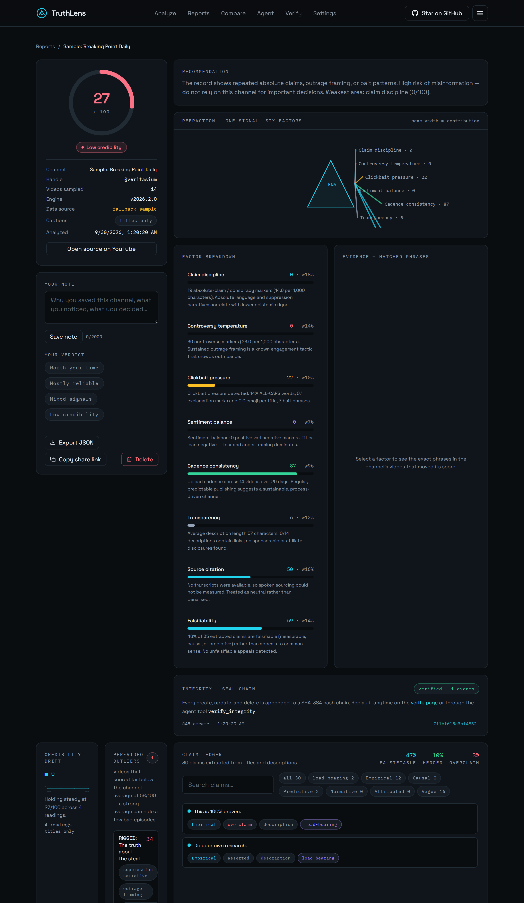
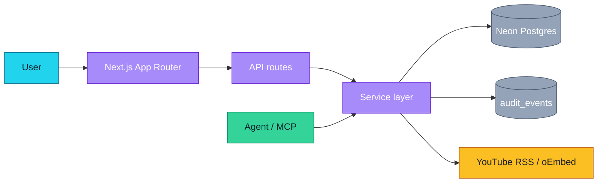
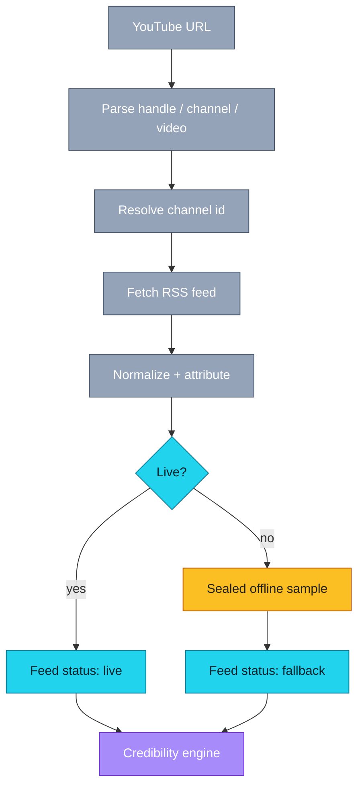
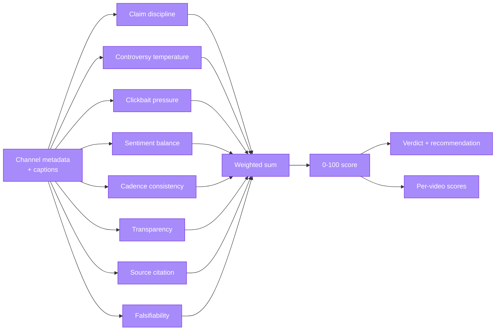
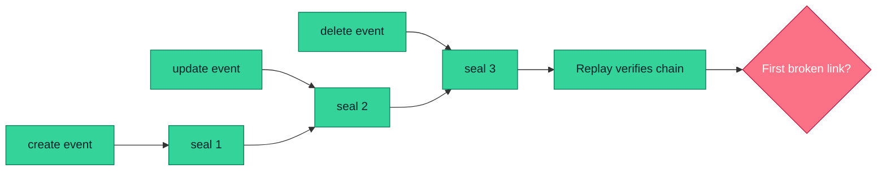
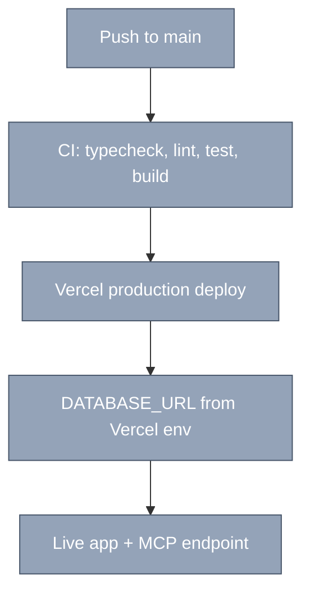
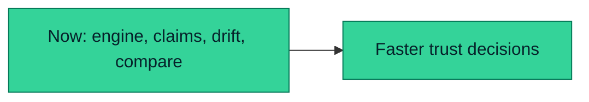
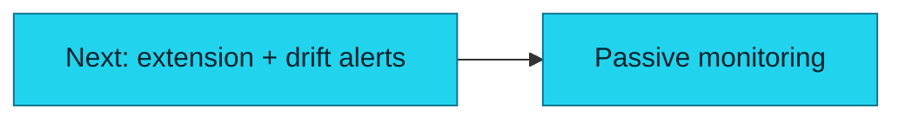
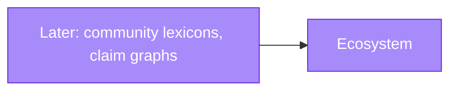

# TruthLens

**Is this creator worth your time?** Paste any YouTube channel link and get an
evidence-backed credibility report — every score traced to the exact phrases that
produced it.

[](https://truthlens-virid.vercel.app)
[](https://github.com/aniruddhaadak80/truthlens)
[](LICENSE)
[](https://nextjs.org)
[](src/lib/engine/credibility.ts)
[](public/mcp.json)

| [Live App](https://truthlens-virid.vercel.app) · [GitHub](https://github.com/aniruddhaadak80/truthlens) · [API](https://truthlens-virid.vercel.app/api/health) · [Agent](https://truthlens-virid.vercel.app/agent) · [Issues](https://github.com/aniruddhaadak80/truthlens/issues) |



## ✨ Features

- **Eight-signal credibility engine** — claim discipline, controversy temperature,
  clickbait pressure, sentiment balance, cadence consistency, transparency, plus
  **source citation** and **falsifiability** derived from what the creator actually
  says. Every factor carries itemized evidence and a weighted contribution.
- **Reads the captions, not just the titles** — pulls public caption tracks and scores
  spoken sourcing, hedging, and self-correction. Coverage is always labelled
  (`full` / `partial` / `titles-only`) so a score is never quietly based on less than it claims.
  > **Caption availability note:** YouTube serves caption payloads only to residential
  > networks. When TruthLens runs from a datacenter or serverless host, captions usually
  > return empty and the report says `titles-only` — in that case the spoken factors score
  > neutral rather than penalising a channel that could not be heard, and the
  > recommendation says so explicitly.
- **Claim ledger** — extracts real assertions and classifies each as empirical, causal,
  predictive, normative, or vague, with hedge and overclaim ratios and a
  load-bearing flag. Deceptively-cited claims surface first.
- **Per-video outliers** — a strong channel average can hide a few bad episodes. Every
  sampled video is scored independently and the weak ones are listed with their flags.
- **Credibility drift** — each analysis records a snapshot, so the trend over time is
  visible: direction, score delta, and which factor moved most.
- **Head-to-head comparison** — put two reports side by side and see exactly which
  factors drive the gap.
- **Live public data, honestly labeled** — reads the channel's public YouTube RSS feed,
  oEmbed metadata, and captions (no API key). When the live feed is unreachable, a
  sealed offline sample is clearly marked `fallback` and never presented as a real channel.
- **Auditable integrity chain** — every create, update, and delete appends a
  SHA-384 sealed event (`seal_n = SHA-384(prevSeal ‖ canonicalJson(event_n))`).
  Each entity chains independently, so any report replays in isolation.
- **Agent-ready** — a JSON-RPC 2.0 MCP endpoint (`POST /api/mcp`) with eight tools to
  analyze, read, decide, verify, read drift, compare, and extract claims — all backed
  by the same service layer as the UI. Manifest at [`public/mcp.json`](public/mcp.json).
- **Export & share** — download a self-contained JSON report or copy a public
  share link. Exports include source attribution, timestamps, and a disclaimer.
- **Session-scoped workspace** — reports persist per browser session (HTTP-only
  cookie), with notes, your own verdict, and full CRUD.

## 🚀 Quickstart

```bash
git clone https://github.com/aniruddhaadak80/truthlens.git
cd truthlens
npm install
npm run dev
```

Open http://localhost:3000 and paste a YouTube channel link. **No environment
variables are required for local development** — TruthLens uses an embedded
in-memory Postgres (PGlite) when `DATABASE_URL` is unset.

### Production variables

| Variable | Required | Description |
| --- | --- | --- |
| `DATABASE_URL` | production only | Hosted Postgres connection string (e.g. Neon). The app refuses to start in production without it. |

See [`.env.example`](.env.example). Never commit real values.

## 🔌 API

All endpoints return JSON. Errors use the envelope `{ "error": { "code", "message" } }`.

### Analyze a channel

```bash
curl -X POST https://truthlens-virid.vercel.app/api/analyze \
  -H 'Content-Type: application/json' \
  -d '{"url":"https://www.youtube.com/@veritasium"}'
```

Response (201): the saved `report`, the versioned `engine` result (score, verdict,
itemized `factors`, `signals`, `recommendation`), and the `audit` seal reference.

### Read back and update

```bash
curl https://truthlens-virid.vercel.app/api/reports/<report-id>

curl -X PATCH https://truthlens-virid.vercel.app/api/reports/<report-id> \
  -H 'Content-Type: application/json' \
  -d '{"note":"Great science communication","user_verdict":"trusted"}'
```

### Delete

```bash
curl -X DELETE https://truthlens-virid.vercel.app/api/reports/<report-id>
```

Soft-deletes (tombstone) and appends a `delete` audit event.

### Other endpoints

| Method | Path | Purpose |
| --- | --- | --- |
| GET | `/api/health` | Store check (verifies the real database) |
| GET | `/api/feed?url=…` | Normalized live feed with source metadata |
| GET | `/api/reports` | List reports for the current session |
| GET | `/api/claims?url=…` | Claim ledger for a channel without saving a report |
| GET | `/api/drift?report=<id>` | Credibility trend for a channel |
| POST | `/api/compare` | Compare two reports factor by factor |
| POST | `/api/reports/<id>/reanalyze` | Re-score and record a new drift snapshot |
| GET | `/api/verify?entity=<id>` | Replay the seal chain |
| GET | `/api/export/<id>` | Download a JSON report |
| POST | `/api/mcp` | JSON-RPC 2.0 agent endpoint |

## 🤖 Agent interface

TruthLens exposes a live MCP-style endpoint. Configure any MCP client with the
manifest at `https://truthlens-virid.vercel.app/mcp.json` (endpoint `POST /api/mcp`).

Tools: `analyze_channel`, `get_report`, `list_reports`,
`update_report_decision` (mutating, idempotent), `verify_integrity`,
`get_channel_drift`, `compare_reports`, `extract_claims`.

```bash
curl -X POST https://truthlens-virid.vercel.app/api/mcp \
  -H 'Content-Type: application/json' \
  -d '{"jsonrpc":"2.0","id":1,"method":"tools/list","params":{}}'
```

The in-page [agent console](https://truthlens-virid.vercel.app/agent) provides one-click
calls and a raw request/response log.

## 📁 Project map

### User routes

| Route | Purpose |
| --- | --- |
| `/` | Landing with the analyzer and live aggregate stats |
| `/reports` | Session workspace: filter, sort, search saved reports |
| `/reports/[id]` | Report detail: score, refraction, factors, evidence, claim ledger, drift, outliers, actions |
| `/compare` | Head-to-head comparison of two saved reports |
| `/agent` | Live MCP agent console |
| `/export` | Export center: download JSON, copy share links |
| `/settings` | Engine weights (persisted per session) and danger zone |
| `/share/[id]` | Public read-only report |
| `/verify` | Integrity chain replay |

### API routes

| Route | Methods |
| --- | --- |
| `/api/analyze` | POST |
| `/api/reports` | GET |
| `/api/reports/[id]` | GET, PATCH, DELETE |
| `/api/reports/[id]/reanalyze` | POST |
| `/api/drift` | GET |
| `/api/compare` | POST |
| `/api/claims` | GET |
| `/api/health` | GET |
| `/api/feed` | GET |
| `/api/verify` | GET |
| `/api/export/[id]` | GET |
| `/api/settings` | GET, PATCH |
| `/api/session` | DELETE |
| `/api/mcp` | POST |

### Source layout

| Path | Responsibility |
| --- | --- |
| `src/lib/engine/credibility.ts` | Deterministic, versioned scoring engine (v2026.2.0) |
| `src/lib/engine/claims.ts` | Claim extraction and the falsifiability taxonomy |
| `src/lib/youtube/fetch.ts` | Keyless YouTube RSS + oEmbed fetching |
| `src/lib/youtube/transcript.ts` | Caption retrieval and parsing |
| `src/lib/integrity/chain.ts` | SHA-384 seal chain and replay |
| `src/lib/db/` | Repository interface; PGlite (local) and pg/Neon (production) adapters |
| `src/lib/service.ts` | Shared service layer used by UI and agent tools |
| `src/middleware.ts` | Anonymous session-cookie bootstrap |
| `src/components/` | UI components (refraction lens, claim ledger, drift panel, compare workbench) |

## 🏗️ Architecture



## 🔁 Data pipeline and fallback



## 🧮 Deterministic engine



`source_citation` and `falsifiability` read the spoken content. When captions are
unavailable they return a neutral score and the report says `titles-only` rather than
penalising a channel that could not be heard. The same `analyzeChannel` function powers
the UI, the REST endpoints, and the agent tools, so a score is always reproducible.

## 🔗 Integrity and seal replay



`seal_n = SHA-384(UTF-8(prevSeal) ‖ canonicalJson(event_n))` with a genesis
value. Canonical JSON recursively sorts object keys. Replay reports the first
broken link, if any.

## 🚢 Deployment pipeline



## 🧭 User journey

```mermaid
graph LR
  LAND[Landing] --> ANALYZE[Analyze channel]
  ANALYZE --> REPORT[Inspect report]
  REPORT --> DECIDE[Note + verdict]
  DECIDE --> AGENT[Agent tool call]
  AGENT --> VERIFY[Verify integrity]
  VERIFY --> EXPORT[Export / share]
  EXPORT --> DELETE[Delete when done]
  classDef live fill:#22d3ee,stroke:#0e7490,color:#06222a
  classDef engine fill:#a78bfa,stroke:#6d28d9,color:#ffffff
  classDef agent fill:#34d399,stroke:#047857,color:#06222a
  class LAND,ANALYZE,REPORT,DECIDE,VERIFY,EXPORT,DELETE live
  class AGENT agent
```



## 🗺️ Roadmap

### Now
- [x] Eight-signal deterministic engine, two factors driven by captions
- [x] Claim ledger with a falsifiability taxonomy
- [x] Per-video outlier detection
- [x] Credibility drift across repeated analyses
- [x] Head-to-head report comparison
- [x] Eight MCP tools on a shared service layer
- [x] JSON export, public share links, and an audited integrity chain



### Next
- [ ] Browser extension for one-click analysis on YouTube (user outcome: no copy-paste)
- [ ] Weekly drift alerts when a watched channel's score moves (user outcome: notice change without checking)



### Later
- [ ] Community lexicon contributions with review (user outcome: sharper, fresher signals)
- [ ] Transcript-level claim graph linking repeated assertions across videos (user outcome: spot evolving narratives)



## ⚠️ Safety disclaimer

TruthLens scores are **deterministic heuristics computed from public metadata**.
They are not fact-checks, do not prove intent, and can misread context, satire, or
non-English content. Verify important claims independently before acting on them.

## 🙏 Attribution

- Video metadata and captions: [YouTube RSS feeds](https://www.youtube.com/feeds/videos.xml),
  [oEmbed](https://www.youtube.com/oembed), and public caption tracks — keyless endpoints.
- Fonts: [Space Grotesk](https://fonts.google.com/specimen/Space+Grotesk) and
  [IBM Plex Mono](https://fonts.google.com/specimen/IBM+Plex+Mono) (OFL),
  self-hosted in `public/fonts/`.
- Database: [Neon](https://neon.tech) Postgres (production); embedded PGlite (local).

## 🤝 Contributing

See [CONTRIBUTING.md](CONTRIBUTING.md). Licensed under the [MIT License](LICENSE).
